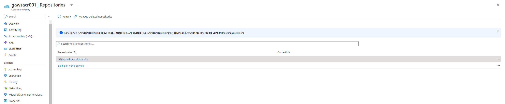

# github-action-workflow-samples

## Table of Contents

- [Summary](#summary)
- [References](#references)
- [How to use](#how-to-use)
  - [Perequisite](#perequisite)
  - [Run Github Action workflows](#run-github-action-workflows)
  - [Results](#results)

## Summary

A collection of Github Action workflow samples. For simplicity and to illustrate the concept, only manual workflow dispatch events will trigger workflows. The demonstration will not include the gitflow workflow with pull request and push request triggers involving dev, release/*, and master branches. Hence, [Semantic Versioning](https://semver.org/lang/de/) will not be taken into account either.

## References

- [login-action Github repository](https://github.com/docker/login-action)
- [Building and testing Go](https://docs.github.com/en/actions/automating-builds-and-tests/building-and-testing-go)
- [Snyk Actions Github repository](https://github.com/snyk/actions)
- [docker-login Action Github repository](https://github.com/Azure/docker-login)
- [build-push-action Github repository. This does not work with [Snyk docker action](https://github.com/snyk/actions/tree/master/docker)](https://github.com/docker/build-push-action)

## How to use

### Perequisite

Setup a/an 

- [Azure Container registry](https://azure.microsoft.com/de-de/products/container-registry) for uploading build and tagged docker images
- [CloudSmith organization](https://cloudsmith.com/pricing) for uploading build artifacts
- [Snyk organization](https://snyk.io/de/plans/) for vulnerability scanning

### Run Github Action workflows

TBD

### Results

- 
